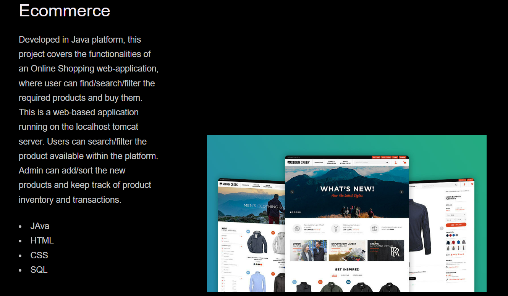

# portfolio-akash

# Picture Home Pages




## Technologies Used

- HTMl - used to create main page
- Css - Styles html page
- Git - version control
- Github - deploying website

## Code Snippet

```html
<header class="header" role="banner" id="top">
  <section class="row">
    <nav class="nav" role="navigation">
      <ul class="nav__items">
        <li class="nav__item"><a href="#work" class="nav__link">Work</a></li>
        <li class="nav__item">
          <a href="#skills" class="nav__link">skills</a>
        </li>
        <li class="nav__item">
          <a href="#about" class="nav__link">About</a>
        </li>
        <li class="nav__item">
          <a href="#contact" class="nav__link">Contact</a>
        </li>
      </ul>
    </nav>
  </section>
  <section class="header__text-box row">
    <section class="header__text">
      <h1 class="heading-primary">
        <span>Akash Chanara</span>
      </h1>

      <p>A Full Stack Developer</p>
      <a href="#contact" class="btn btn--pink">Get in touch</a>
    </section>
  </section>
</header>
```

### This code used for navigation websites

## Tools

1. VsCode
2. Git (windows)
3. Github

# Getting Start

This project is about MY portfolio. There are few steps to run this project.

## Prerequisites

Software need to be install

- Vscode
- git
- github(clone project)

# Installation

1. Setup SSH key
2. Git clone to terminal or gitbash
   (https://akash2040.github.io/portfolio-akash/)
3. Enter github password

### Project is ready to use Open index.html to default browser

## Author Links

[Github](https://github.com/akash2040/portfolio-akash)
